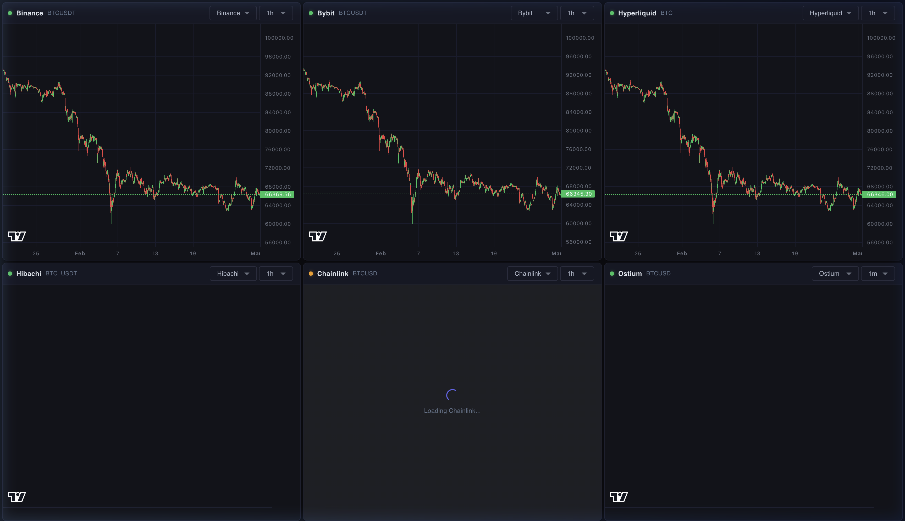

# Tick: Multi-Platform Candlestick Dashboard

A full-stack, real-time trading dashboard that aggregates and displays candlestick data from **6 different platforms** in a single unified 3x2 grid view. 

The dashboard provides up to **1 year of historical backfill** and merges it with **live WebSocket/polling updates** for a seamless charting experience.

 *(Replace with actual screenshot if desired)*

---

## 🏗 Features & Architecture

### Supported Platforms
1. **Binance**: Full 1-year REST history + Live WS streaming.
2. **Bybit**: Full 1-year REST history + Live WS streaming.
3. **Hyperliquid**: ~7 months REST history (`candleSnapshot`) + Live WS streaming.
4. **Hibachi**: REST history + WS streaming.
5. **Chainlink**: 1-year BTC/USD proxy history via Binance + Live On-chain RPC Polling.
6. **Ostium**: Real-time tick aggregation from price feeds (in-memory candles).

### Tech Stack
- **Frontend**: React + TypeScript + Vite + Material UI + Lightweight Charts.
- **Backend**: Node.js + Express + TypeScript + WebSockets.

### Design Decisions
- **`DataAdapter` Base Class**: Standardized abstract class `DataAdapter.ts` handles generic event emitting and defines `fetchHistory()`. Every platform adapter extends this.
- **Backend Aggregator**: `StreamAggregator.ts` manages connections to all adapters, forwards live ticks to a central WebSocket server, and exposes REST endpoints for historical fetches.
- **Smart Data Merging**: The React frontend fetches up to 1 year of historical candles on mount via REST, then uses `update()` to seamlessly merge real-time WebSocket ticks onto the existing chart.

---

## 🚀 Setup & Installation

### Prerequisites
- Node.js (v18+ recommended)
- npm or yarn

### 1. Clone the repository
```bash
git clone https://github.com/sannithshetty/tick.git
cd tick
```

### 2. Setup the Backend
The backend serves the REST API (history) and WebSocket server (live data).
```bash
cd backend
npm install
npm run start
```
*The backend will start on `http://localhost:8040`.*

### 3. Setup the Frontend
Open a new terminal window and start the Vite dev server.
```bash
cd frontend
npm install
npm run dev
```
*The frontend will start on `http://localhost:4080`. Open this in your browser.*

---

## 📡 API Endpoints (Backend)

| Method | Endpoint | Description |
|--------|----------|-------------|
| `GET` | `/api/sources` | Returns a list of all active data sources and their supported intervals. |
| `GET` | `/api/intervals/:source` | Returns supported intervals for a specific source (e.g., `Binance`). |
| `GET` | `/api/history/:source` | Fetches OHLCV historical data. Accepts `interval`, `startTime`, and `endTime` query params. |
| `WS` | `ws://localhost:8040` | Streams real-time `price_update` JSON events for all sources. |

---

## ⚠️ Known Limitations & Quirks

- **Hibachi API**: The public websockets (`wss://api.hibachi.xyz/ws/market`) currently refuse WebSocket upgrades and return HTTP 200. This requires their official API documentation to correct the connection paths.
- **Chainlink Oracle Speed**: Reading 1 year of historical rounds directly from the Ethereum RPC sequentially takes several minutes and triggers timeouts. To ensure instant dashboard loading, the Chainlink adapter proxies historical BTC/USD data from Binance (which tracks the oracle ~1:1), while still pulling live real-time prices directly from the on-chain contract.
- **Ostium History**: Ostium does not provide an official historical candlestick API. The adapter polls their latest price feed and builds OHLCV candles in-memory at runtime. 

---

## 🔒 Security
No API keys or private secrets are required to run this project. All adapters utilize public REST endpoints and public WebSocket streams.
